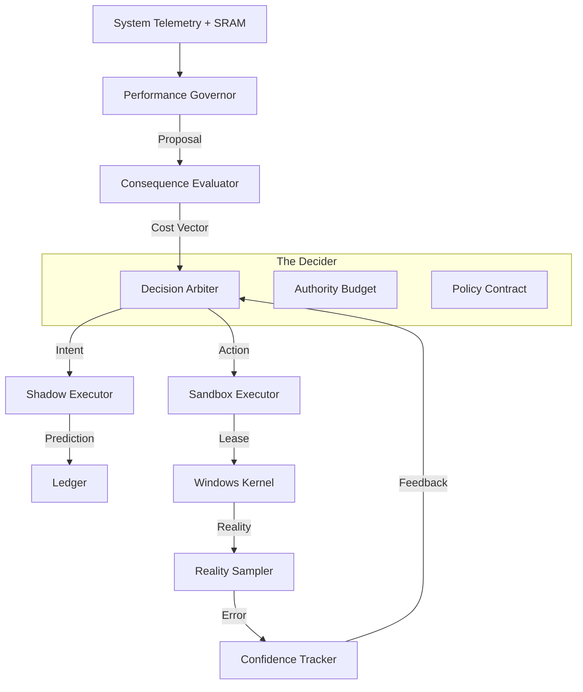

# System Architecture v5.0

## Overview

PMan v5 represents a paradigm shift from a **Rule-Based System** to an **Autonomous Agent**. Instead of static "If/Then" triggers, the system operates on a **Cognitive Control Loop** (Observation → Prediction → Arbitration → Execution → Learning).

The system is designed as a **Governor**, not a simple optimizer. It possesses a "budget" of authority and must "pay" for interventions using confidence credits. If its predictions fail to materialize in reality, it loses confidence and reduces its own authority.

---

## The Cognitive Pipeline (The "Brain")

The core logic resides in `RunAutonomousCycle`, executing the following pipeline once per tick:

---

### 1. Perception Layer (The Eyes)

**SystemSignalSnapshot**: A normalized vector containing CPU load, saturation (Queue Length), memory pressure, disk I/O, and thermal status.

**SRAM (System Responsiveness Awareness Module)**: A dedicated sidecar thread that measures actual human-perceptible lag.
- **Technique**: Sends `WM_NULL` messages to the foreground window and measures round-trip time.
- **Output**: `LagState` (Snappy, Pressure, Lagging, Critical).

**Input Guardian**: Monitors raw HID (Mouse/Keyboard) interrupts to detect user intent vs. idle activity.

---

### 2. Decision Layer (The Brain)

**Performance Governor** (`governor.cpp`):
- **Role**: The Strategist.
- **Logic**: Analyzes `DominantPressure` (e.g., is the bottleneck Disk or CPU?). Resolves the `SystemMode` (Interactive vs. Sustained Load).
- **Output**: `GovernorDecision` (e.g., "We are in Interactive Mode, causing Latency Pressure; I propose Scheduling Intervention").

**Consequence Evaluator**:
- **Role**: The Simulator.
- **Logic**: Calculates the "Cost" of the proposed action. (e.g., "Boosting priority here will starve Audio threads by 15%").

**Decision Arbiter** (`decision_arbiter.cpp`):
- **Role**: The Judge.
- **Logic**: Weighs the Proposal against the Authority Budget and Confidence Levels.
- **Counterfactuals**: It records not just what it decided, but why it rejected the alternatives (e.g., "Rejected Boost due to Low Confidence").

---

### 3. Execution Layer (The Hands)

**Sandbox Executor** (`sandbox_executor.cpp`):
- **Role**: The Operator.
- **Mechanism**: Leased Authority.
- **Logic**: Actions are not "set and forgotten." They are "leased" for a specific duration (e.g., 5000ms). If the Brain does not explicitly renew the lease in the next tick, the Sandbox automatically reverts the changes. This ensures that a frozen or crashed agent cannot leave the system in a modified state.

---

### 4. Accountability Layer (The Conscience)

**Provenance Ledger** (`provenance_ledger.cpp`):
- **Role**: The Black Box.
- **Logic**: Cryptographically hashes and logs every decision tick. It provides an audit trail proving why the AI acted (or refused to act).

**Outcome Guard** (`outcome_guard.cpp`):
- **Role**: The Fail-Safe.
- **Logic**: Compares `PredictedStateDelta` (Shadow) vs. `ObservedStateDelta` (Reality). If Reality is significantly worse than Predicted (e.g., "We optimized, but Latency increased"), it triggers an immediate Emergency Rollback.

---

## Subsystem Details

### SRAM (System Responsiveness Awareness Module)

SRAM is a detached diagnostic engine designed to detect "Ghosting" and "Micro-stutters" that standard CPU metrics miss.

**Thread Isolation**: Runs on a separate thread with `ABOVE_NORMAL` priority to ensure it can observe the system even under load.

**Metrics**:
- **UI Latency**: `SendMessageTimeout(WM_NULL)`
- **DWM Composition**: Frame drops in the Desktop Window Manager.
- **Input Latency**: Delta between hardware interrupt and message queue processing.

---

### The Authority Budget

To prevent "thrashing" (rapidly changing states), the AI has a finite budget of "Authority Points."

- **Cost Model**: High-impact actions (e.g., Thread Boosting) cost more than low-impact ones (e.g., Memory Trimming).
- **Regen**: Budget regenerates slowly over time.
- **Exhaustion**: If the budget hits zero, the Arbiter is forced to `BrainAction::Maintain` (Do Nothing) until it cools down.

---

## Safety & Crash Resilience

### 1. The "Do No Harm" Prime Directive

The system defaults to `BrainAction::Maintain`. If any component (Telemetry, Policy, Budget) fails or returns ambiguous data, the Arbiter rejects intervention.

### 2. Registry Guard (Watchdog)

A separate process (`pman.exe --guard`) monitors the main application.

- **Heartbeat**: If the main process terminates unexpectedly (crash or Task Manager kill), the Guard detects the handle closure.
- **Restoration**: It immediately reverts global Windows settings (Win32PrioritySeparation, Power Plans) to their defaults before exiting.

### 3. Provenance Integrity

If the `ProvenanceLedger` fails to write (disk full, permission error), the `OutcomeGuard` revokes all authority. The system cannot act if it cannot record why.

---

## Threading Model

| Thread | Priority | Responsibility |
|--------|----------|----------------|
| **Main Thread** | NORMAL | Window Message Pump, Policy Orchestration, UI Rendering |
| **SRAM Worker** | ABOVE_NORMAL | Active latency probing (UI/Input sensors) |
| **Background Worker** | LOW | Heavy lifting: Service Control, Config Reloading, Profile Analysis |
| **ETW Consumer** | TIME_CRITICAL* | Consumes kernel events (context switches) in real-time |
| **IOCP Watcher** | LOW | File system changes (Config hot-reload) |

*ETW Consumer runs at high priority but performs minimal work, pushing events to a lock-free queue for the Background Worker.