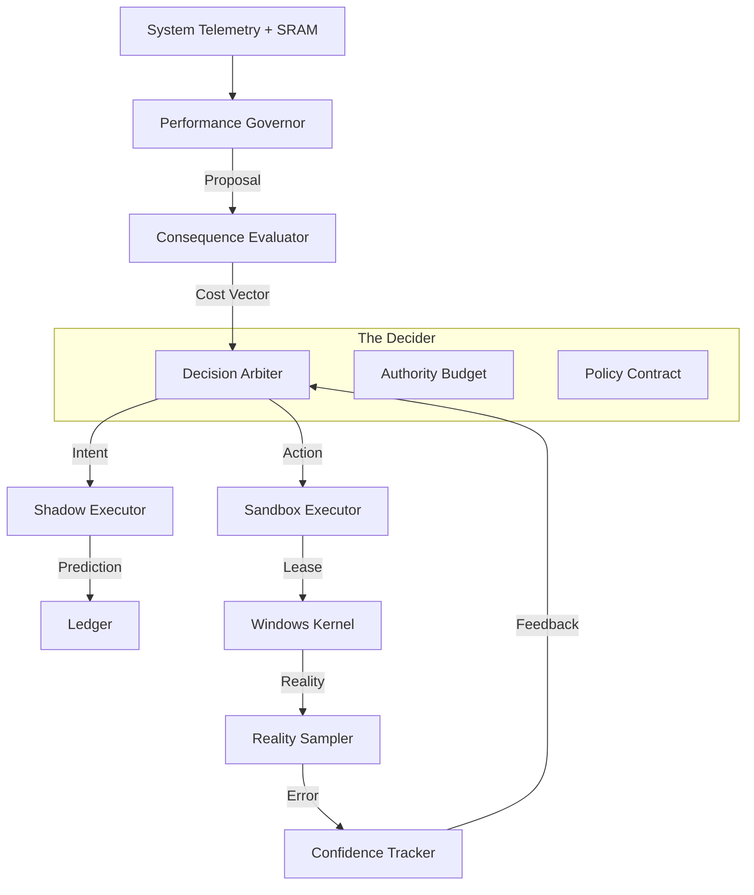

# System Architecture v5.0

## Overview

PMan v5 represents a shift from a **Rule-Based System** to an **Adaptive Control System**. Instead of static "If/Then" triggers, the system operates on a **Feedback Control Loop** (Observation → Prediction → Arbitration → Execution → Learning).

The system is designed as a **Governor**, not a simple optimizer. It possesses a "budget" of authority and must "pay" for interventions. If its predictions fail to materialize in reality (e.g., latency increases despite optimization), it updates its statistical model to reduce confidence in that action.

---

## The Control Pipeline (The "Brain")

The core logic resides in `RunAutonomousCycle` (in `main.cpp`), executing the following pipeline once per tick:

---

### 1. Perception Layer (The Eyes)

**SystemSignalSnapshot**: A normalized vector containing CPU load, saturation (Queue Length), memory pressure, disk I/O, and thermal status.

**SRAM (System Responsiveness Awareness Module)**: A dedicated sidecar thread that measures actual application responsiveness.
- **Technique**: Sends `SendMessageTimeout(WM_NULL)` to the foreground window and measures the round-trip time.
- **Output**: `LagState` (Snappy, Pressure, Lagging, Critical).

**Input Guardian**: Monitors raw HID (Mouse/Keyboard) interrupts via `RegisterRawInputDevices` to detect user intent vs. idle activity.

---

### 2. Decision Layer (The Logic)

**Performance Governor** (`governor.cpp`):
- **Role**: The Strategist.
- **Logic**: Analyzes `DominantPressure` (e.g., is the bottleneck Disk or CPU?). Resolves the `SystemMode` (Interactive vs. Sustained Load).
- **Output**: `GovernorDecision` (e.g., "We are in Interactive Mode, causing Latency Pressure; I propose Scheduling Intervention").

**Consequence Evaluator**:
- **Role**: The Simulator.
- **Logic**: Calculates the "Cost" of the proposed action. (e.g., "Boosting priority here will starve Audio threads by 15%").

**Decision Arbiter** (`decision_arbiter.cpp`):
- **Role**: The Judge.
- **Logic**: Weighs the Proposal against the Authority Budget and Confidence Levels.
- **Counterfactuals**: It records not just what it decided, but why it rejected the alternatives (e.g., "Rejected Boost due to Low Confidence").

---

### 3. Execution Layer (The Hands)

**Sandbox Executor** (`sandbox_executor.cpp`):
- **Role**: The Operator.
- **Mechanism**: Leased Authority.
- **Logic**: Optimizations are applied as "leases" for a specific duration (default ~5000ms). If the main loop does not explicitly renew the lease in the next tick, the Sandbox automatically reverts the changes. This ensures that a frozen or crashed agent cannot leave the system in a modified state.

---

### 4. Accountability Layer (The Audit)

**Provenance Ledger** (`provenance_ledger.cpp`):
- **Role**: The Audit Trail.
- **Logic**: Logs every decision tick to a structured JSON stream. It records the active policy hash, the inputs, and the decision rationale.

**Outcome Guard** (`outcome_guard.cpp`):
- **Role**: The Fail-Safe.
- **Logic**: Compares `PredictedStateDelta` (Shadow) vs. `ObservedStateDelta` (Reality). If Reality is significantly worse than Predicted (e.g., "We optimized, but Latency increased"), it triggers an immediate Rollback.

---

## Subsystem Details

### SRAM (System Responsiveness Awareness Module)

SRAM is a detached diagnostic engine designed to detect "Ghosting" and "Micro-stutters" that standard CPU metrics miss.

**Thread Isolation**: Runs on a separate thread with `THREAD_PRIORITY_NORMAL` (to avoid preempting the UI it is measuring).

**Metrics**:
- **UI Latency**: `SendMessageTimeout` round-trip time.
- **DWM Composition**: Frame drops via `DwmGetCompositionTimingInfo`.
- **Input Latency**: Delta between hardware interrupt timestamp and message processing time.

---

### The Authority Budget

To prevent "thrashing" (rapidly changing states), the AI has a finite budget of "Authority Points."

- **Cost Model**: High-impact actions (e.g., Service Suspension) cost more than low-impact ones (e.g., Thread Boosting).
- **Regen**: Budget regenerates over time.
- **Exhaustion**: If the budget hits zero, the Arbiter is forced to `BrainAction::Maintain` (Do Nothing) until it cools down.

---

## Safety & Crash Resilience

### 1. The "Do No Harm" Prime Directive

The system defaults to `BrainAction::Maintain`. If any component (Telemetry, Policy, Budget) fails or returns ambiguous data, the Arbiter rejects intervention.

### 2. Registry Guard (Watchdog)

A separate process (`pman.exe --guard`) monitors the main application.

- **Heartbeat**: If the main process terminates unexpectedly (crash or Task Manager kill), the Guard detects the handle closure.
- **Restoration**: It immediately reverts global Windows settings (Win32PrioritySeparation, Power Plans) to their defaults before exiting.

### 3. Integrity Checks

If the `ProvenanceLedger` fails to write (disk full, permission error), the system declares a **Fault State** and revokes authority. The agent is not allowed to act if it cannot be audited.

---

## Threading Model

| Thread | Priority | Responsibility |
|--------|----------|----------------|
| **Main Thread** | NORMAL | Window Message Pump, Policy Orchestration, UI Rendering |
| **SRAM Worker** | NORMAL | Active latency probing (UI/Input sensors) |
| **Background Worker** | LOWEST | Heavy lifting: Service Control, Config Reloading, Profile Analysis |
| **ETW Consumer** | TIME_CRITICAL* | Consumes kernel events (context switches) in real-time |
| **IOCP Watcher** | LOWEST | File system changes (Config hot-reload) |

*ETW Consumer runs at high priority but performs minimal work, pushing events to a lock-free queue for the Background Worker.